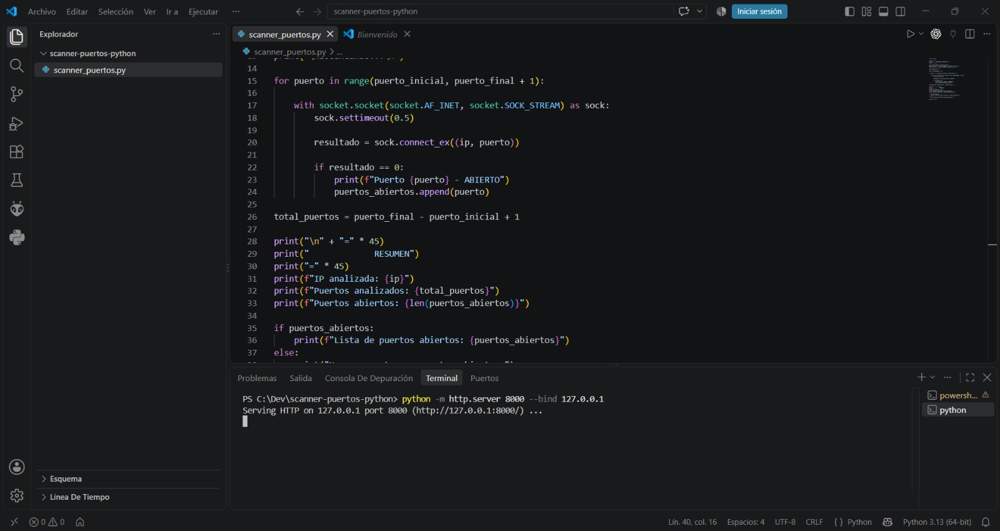
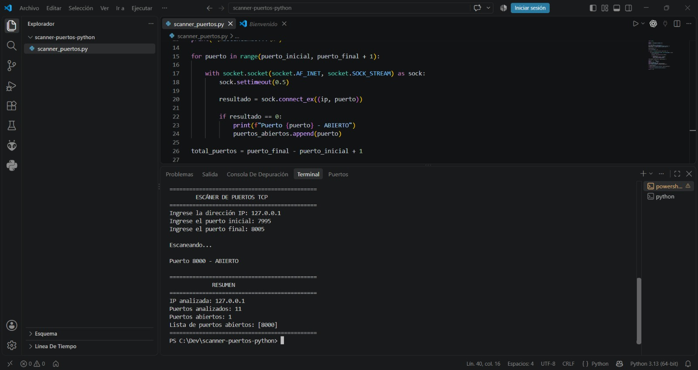

# Manual de Uso
## Escáner de Puertos TCP en Python

### Asignatura: Seguridad Informática
### Universidad Estatal de Milagro - UNEMI

---

## 1. Introducción

El presente manual explica el procedimiento para instalar, ejecutar y utilizar la aplicación **Escáner de Puertos TCP**, desarrollada en Python como parte de la práctica de la asignatura Seguridad Informática.

La aplicación permite ingresar la dirección IP de un equipo autorizado, seleccionar un rango de puertos TCP y comprobar cuáles de esos puertos se encuentran abiertos.

El programa fue desarrollado con fines académicos y debe utilizarse únicamente sobre equipos propios, máquinas virtuales, laboratorios o redes donde exista autorización.

---

## 2. Objetivo del programa

El objetivo de la aplicación es permitir la identificación básica de puertos TCP abiertos en un equipo autorizado mediante el uso de la biblioteca `socket` de Python.

El programa permite:

- Ingresar una dirección IP.
- Ingresar un puerto inicial.
- Ingresar un puerto final.
- Analizar el rango de puertos indicado.
- Identificar los puertos TCP abiertos.
- Mostrar un resumen de los resultados.
- Validar datos incorrectos ingresados por el usuario.

---

## 3. Requisitos

Para ejecutar correctamente la aplicación se necesita:

### 3.1 Hardware

- Computadora de escritorio o portátil.
- Conexión de red, cuando se trabaje con otro equipo autorizado.
- Espacio disponible para almacenar el proyecto.

### 3.2 Software

- Sistema operativo Windows, Linux o macOS.
- Python 3.
- Visual Studio Code o cualquier editor de código.
- Terminal o PowerShell.
- Biblioteca `socket`.

La biblioteca `socket` forma parte de la biblioteca estándar de Python, por lo que no necesita instalarse mediante `pip`.

---

## 4. Comprobación de Python

Antes de ejecutar el programa se debe comprobar que Python se encuentre instalado.

Abrir PowerShell o una terminal y ejecutar:

```powershell
python --version
```

En el equipo utilizado para la práctica se obtuvo:

```text
Python 3.13.15
```

También se puede comprobar mediante:

```powershell
py --version
```

Resultado:

```text
Python 3.13.15
```

Si Python no se encuentra instalado, en Windows puede instalarse mediante:

```powershell
winget install -e --id Python.Python.3.13
```

Después de la instalación se recomienda cerrar y volver a abrir PowerShell o Visual Studio Code.

---

## 5. Archivos del proyecto

El proyecto contiene la siguiente estructura:

```text
scanner-puertos-python/
│
├── scanner_puertos.py
├── README.md
├── MANUAL_USO.md
└── evidencias/
    ├── 01_servidor_http_local.jpeg
    └── 02_escaneo_exitoso.jpeg
```

### Descripción de los archivos

**scanner_puertos.py**

Contiene el código fuente de la aplicación.

**README.md**

Contiene una descripción general del proyecto y sus características.

**MANUAL_USO.md**

Contiene las instrucciones de instalación y funcionamiento del programa.

**evidencias/**

Contiene capturas de pantalla obtenidas durante las pruebas experimentales.

---

## 6. Descarga del proyecto

El proyecto puede obtenerse desde el repositorio de GitHub:

```text
https://github.com/AnubisProjekts/scanner-puertos-python
```

Puede descargarse mediante la opción **Code > Download ZIP** disponible en GitHub.

También puede clonarse mediante Git utilizando:

```powershell
git clone https://github.com/AnubisProjekts/scanner-puertos-python.git
```

Después se debe ingresar a la carpeta:

```powershell
cd scanner-puertos-python
```

---

## 7. Ejecución desde Visual Studio Code

Abrir Visual Studio Code.

Seleccionar:

```text
Archivo > Abrir carpeta
```

Seleccionar la carpeta:

```text
scanner-puertos-python
```

También es posible abrir directamente el proyecto desde PowerShell:

```powershell
cd C:\Dev\scanner-puertos-python
code .
```

Una vez abierto el proyecto, seleccionar el archivo:

```text
scanner_puertos.py
```

---

## 8. Cómo iniciar la aplicación

Abrir la terminal integrada de Visual Studio Code o PowerShell.

Ubicarse en la carpeta del proyecto:

```powershell
cd C:\Dev\scanner-puertos-python
```

Ejecutar:

```powershell
python scanner_puertos.py
```

La aplicación mostrará:

```text
=============================================
        ESCÁNER DE PUERTOS TCP
=============================================
Ingrese la dirección IP:
```

---

## 9. Ingreso de la dirección IP

El primer dato solicitado corresponde a la dirección IP del equipo que será analizado.

Ejemplo:

```text
Ingrese la dirección IP: 127.0.0.1
```

Para la práctica experimental se utilizó:

```text
127.0.0.1
```

La dirección `127.0.0.1` corresponde a la dirección de loopback o localhost, es decir, representa al mismo equipo donde se está ejecutando la aplicación.

Su utilización permitió realizar una prueba controlada sin analizar dispositivos externos.

---

## 10. Ingreso del puerto inicial

Después de introducir la IP, el programa solicita el primer puerto que será analizado.

Para la prueba se ingresó:

```text
Ingrese el puerto inicial: 7995
```

Esto indica que el análisis comenzará en el puerto TCP 7995.

---

## 11. Ingreso del puerto final

A continuación se solicita el último puerto que será analizado.

Para la prueba se ingresó:

```text
Ingrese el puerto final: 8005
```

Por lo tanto, el rango analizado fue:

```text
7995 - 8005
```

La aplicación incluyó ambos extremos del rango, por lo que fueron examinados 11 puertos TCP.

---

## 12. Preparación de la prueba experimental

Para comprobar que la aplicación podía detectar correctamente un puerto abierto, se creó temporalmente un servidor HTTP local utilizando Python.

Se abrió una segunda ventana de PowerShell y se ejecutó:

```powershell
python -m http.server 8000 --bind 127.0.0.1
```

Se obtuvo:

```text
Serving HTTP on 127.0.0.1 port 8000
```

Esto significa que Python inició un servidor HTTP local y dejó el puerto TCP 8000 disponible para aceptar conexiones.

### Evidencia del servidor HTTP local



---

## 13. Ejecución del escaneo

Con el servidor HTTP ejecutándose en otra terminal, se inició la aplicación:

```powershell
python scanner_puertos.py
```

Se ingresaron los datos:

```text
Ingrese la dirección IP: 127.0.0.1
Ingrese el puerto inicial: 7995
Ingrese el puerto final: 8005
```

Posteriormente el programa mostró:

```text
Escaneando...
```

La aplicación fue comprobando uno por uno los puertos TCP comprendidos en el rango seleccionado.

---

## 14. Resultado obtenido

Durante el análisis se detectó:

```text
Puerto 8000 - ABIERTO
```

Al finalizar el proceso, la aplicación mostró:

```text
=============================================
               RESUMEN
=============================================
IP analizada: 127.0.0.1
Rango analizado: 7995 - 8005
Puertos analizados: 11
Puertos abiertos: 1
Lista de puertos abiertos: [8000]
=============================================
```

### Evidencia del escaneo



---

## 15. Interpretación de los resultados

El resultado:

```text
Puerto 8000 - ABIERTO
```

indica que el programa logró establecer una conexión TCP con el puerto 8000 del equipo analizado.

Esto ocurrió porque previamente se había iniciado un servidor HTTP escuchando en ese puerto.

Los demás puertos del rango no fueron mostrados debido a que no aceptaron una conexión TCP durante la prueba.

Los resultados experimentales fueron:

| Elemento | Resultado |
|---|---|
| IP utilizada | 127.0.0.1 |
| Puerto inicial | 7995 |
| Puerto final | 8005 |
| Puertos analizados | 11 |
| Puertos abiertos | 1 |
| Puerto encontrado | 8000/TCP |

---

## 16. Funcionamiento básico del escáner

El programa utiliza la biblioteca:

```python
import socket
```

Para cada puerto se crea un socket TCP:

```python
socket.socket(socket.AF_INET, socket.SOCK_STREAM)
```

`AF_INET` indica que se utilizarán direcciones IPv4.

`SOCK_STREAM` indica que se utilizará el protocolo TCP.

Posteriormente se utiliza:

```python
connect_ex()
```

Esta función intenta establecer una conexión con el puerto especificado.

Cuando el resultado es:

```text
0
```

significa que la conexión pudo establecerse y, por lo tanto, el programa considera el puerto como abierto.

---

## 17. Tiempo de espera de conexión

Para evitar que el programa permanezca demasiado tiempo esperando una respuesta se utiliza:

```python
sock.settimeout(0.5)
```

Esto establece un tiempo máximo de espera de aproximadamente 0,5 segundos para cada intento de conexión.

---

## 18. Validación de dirección IP

La aplicación comprueba que la dirección IP ingresada tenga un formato válido.

Por ejemplo, si se introduce:

```text
Ingrese la dirección IP: dir
```

el programa responde:

```text
Error: La dirección IP ingresada no es válida.
```

Esto evita continuar el análisis con una dirección incorrecta.

---

## 19. Validación de los puertos

Los puertos TCP y UDP utilizan valores comprendidos entre:

```text
1 y 65535
```

El programa verifica que el rango ingresado se encuentre dentro de esos límites.

Por ejemplo:

```text
Ingrese el puerto inicial: 0
Ingrese el puerto final: 0
```

produce:

```text
Error: Los puertos deben estar entre 1 y 65535.
```

---

## 20. Validación del orden del rango

El puerto inicial no puede ser mayor que el puerto final.

Por ejemplo:

```text
Puerto inicial: 9000
Puerto final: 8000
```

sería considerado incorrecto.

La aplicación informa:

```text
Error: El puerto inicial no puede ser mayor que el puerto final.
```

---

## 21. Validación de valores numéricos

Si el usuario introduce letras en lugar de números al solicitar los puertos, el programa evita cerrarse inesperadamente.

Ejemplo:

```text
Ingrese el puerto inicial: abc
```

El programa muestra:

```text
Error: Los puertos deben ser números enteros.
```

---

## 22. Cómo detener el servidor HTTP utilizado para la prueba

Una vez finalizado el escaneo, se debe regresar a la terminal donde se está ejecutando:

```powershell
python -m http.server 8000 --bind 127.0.0.1
```

Presionar:

```text
Ctrl + C
```

Esto detendrá el servidor HTTP y cerrará nuevamente el puerto utilizado para la prueba.

---

## 23. Nueva prueba después de cerrar el servidor

Si se vuelve a ejecutar el escáner después de detener el servidor HTTP, es posible que el puerto 8000 ya no aparezca como abierto.

Esto permite comprobar experimentalmente la relación existente entre un servicio que está escuchando y el estado de un puerto TCP.

---

## 24. Posibles problemas y soluciones

### Python no se reconoce

Mensaje:

```text
python no se reconoce como un comando
```

Solución:

Comprobar:

```powershell
python --version
```

Si Python no está instalado, instalarlo y volver a abrir la terminal.

---

### Dirección IP incorrecta

Mensaje:

```text
Error: La dirección IP ingresada no es válida.
```

Solución:

Comprobar que la dirección esté escrita correctamente.

Ejemplo válido:

```text
127.0.0.1
```

---

### Puerto fuera de rango

Mensaje:

```text
Error: Los puertos deben estar entre 1 y 65535.
```

Solución:

Ingresar puertos comprendidos entre 1 y 65535.

---

### No aparecen puertos abiertos

Esto no necesariamente significa que la aplicación esté fallando.

Puede significar que ningún servicio está escuchando en los puertos analizados.

Para realizar una prueba controlada puede iniciarse nuevamente:

```powershell
python -m http.server 8000 --bind 127.0.0.1
```

y analizar un rango que incluya el puerto 8000.

---

## 25. Recomendaciones para la ejecución

Para obtener resultados adecuados se recomienda:

- Comprobar correctamente la dirección IP.
- Seleccionar un rango razonable de puertos.
- Verificar que el equipo analizado sea propio o autorizado.
- Evitar cerrar el programa mientras el análisis se encuentra en ejecución.
- No utilizar el programa sobre sistemas ajenos.
- Registrar mediante capturas las pruebas efectuadas.

---

## 26. Uso ético y responsable

El escaneo de puertos es una técnica utilizada para identificar servicios de red disponibles en un sistema.

Aunque puede utilizarse para administración y evaluación de seguridad, también puede emplearse de manera inadecuada.

Por este motivo, esta aplicación debe utilizarse únicamente sobre:

- Equipos propios.
- Máquinas virtuales propias.
- Equipos de laboratorio.
- Redes institucionales expresamente autorizadas.
- Sistemas para los cuales exista permiso del propietario.

No se debe utilizar para realizar reconocimiento o escaneo sobre servidores, computadoras o redes de terceros sin autorización.

---

## 27. Conclusión del manual

La aplicación desarrollada permite realizar de forma sencilla un escaneo básico de puertos TCP utilizando Python.

Durante la prueba experimental se utilizó la dirección local `127.0.0.1`, se analizó el rango comprendido entre los puertos 7995 y 8005 y se detectó correctamente el puerto TCP 8000 como abierto.

El puerto pudo ser identificado debido a que previamente se inició un servidor HTTP local en dicho puerto.

La prueba permitió comprobar de forma controlada el funcionamiento del programa y comprender la relación entre los servicios de red y los puertos TCP abiertos.

---

## 28. Repositorio del proyecto

El código fuente, el presente manual y las evidencias se encuentran publicados en GitHub:

```text
https://github.com/AnubisProjekts/scanner-puertos-python
```

---

## 29. Advertencia

Esta herramienta fue desarrollada exclusivamente con fines educativos para la asignatura Seguridad Informática de la Universidad Estatal de Milagro.

Su utilización debe realizarse de manera ética, responsable y únicamente sobre sistemas autorizados.